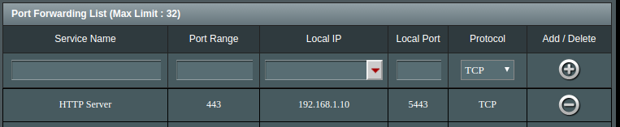
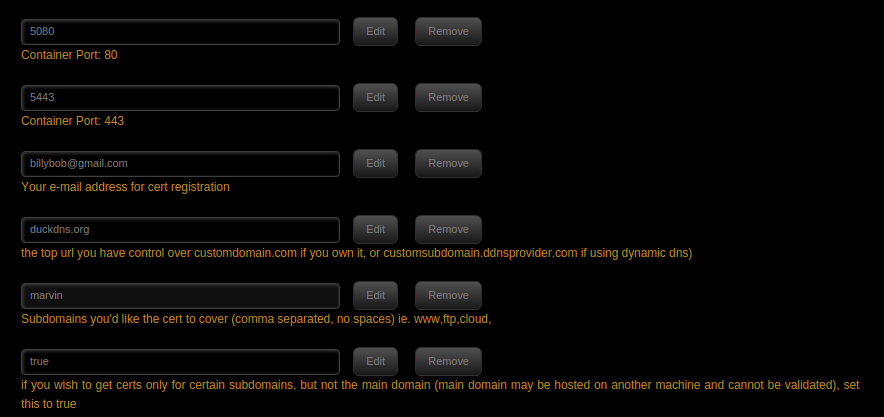
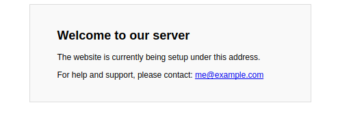
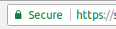

# SageTV SSL Reverse Proxy

This guide covers the situation where you want to have an internet facing web server with a known domain, like, `marvin.duckdns.org`, that will proxy your SageTV web server with SSL enabled.

This guides requires...
* You have a known DNS entry, like, `marvin.duckdns.org`, that goes to your router.
* You have unRAID setup
* You know your internet IP Address (If not, then just google [What's my IP](https://www.google.ca/search?q=what%27s+my+IP&oq=what%27s+my+IP&aqs=chrome..69i57j0l5.2814j0j4&sourceid=chrome&ie=UTF-8))
* You know your SageTV IP Address
* SageTV Web Server plugin is setup and working

## Configure Dynamic DNS Service
If you already have a Dynamic DNS service, like [DuckDNS](https://www.duckdns.org/), DynDNS, etc, configured, then you can skip this.

I'm not going to go into details about how you configure this, only to say, that a Dynamic DNS service is used to map your Router's Internet Address to some hostname that you choose.  For example, you might choose to use `marvin.duckdns.org` and have that dynamically route to your home router, that in turn, would route to your internal SageTV server.

`NOTE:` Many routers have configurations for Dynamic DNS Server services that will keep the DNS host entry up to date, even if your Router's IP Address changes.

For the purposes of this guide, I will assume your DNS Hostname is `marvin.duckdns.org`.

## Configure your Router ##
We are going to configure your Router to point the NGINX Server running on unRAID (which we haven't setup, yet.  We'll do that later).

Again, not going to detail "how" to do this, since every router is different, but, for logical steps are...
* Assume your unRAID internal Server Address is `192.168.1.10`
* Assume your NGINX HTTPS Server, on unRAID, will run run on port `5443`

In your router, in the WAN settings, find `Port Forwarding`.

Configure Port Range `443` (The external SSL port) to forward to your NGINX Server on unRAID, `192.168.1.10`, to port `5443`.

On an ASUS Router it would look something like this.



We can't test it yet, but, the port forwarding should be setup.

## Install NGINX (Let's Encrypt) ##

[Let's Encrypt](https://letsencrypt.org/) is a `Free` and automated SSL Certificate Authority, that can issue you a valid SSL certificate for your domain.

unRAID has a docker container called `"Let's Encrypt"` by the `linuxserver.io` team.  This Docker requires some configuration such as your domain name, etc, and it will take care of creating the SSL Certificate and installing it into the server.   

Find `Let's Encrypt` in the Community Apps, and install it.



The important parts are the Email Address, the top level domain, ie, `duckdns.org`, and the subdomain (or host) that you are registering, such as `marvin` (note, no period), the value `true` to ONLY fetch the certificate for the `marvin.duckdns.org` and not `duckdns.org`.

So the rest of the settings you can leave as default.

Once you have set all the parameters, and you have doubled them for typos, then press, `OK` or `Apply` (Whichever button is present), and this will then install the container, and do all the SSL verifications.

This process can take a few minutes, but if it fails, then it'll fail fairly quickly.  The main reason that this would fail, is if your haven't configured the Port Forwarding on the your router, OR, you haven't configured your Dynamic DNS correctly.

Once you install this, check the `Logs` in the unRAID application to see what it is doing.

If All goes well, you should be able to enter, https://marvin.duckdns.org/, and go to your home router and see a page like this.
 
 

## Configure Access to SageTV ##

Once you can access the NGINX server, externally, the next challenge is to configure NGINX to `Reverse Proxy` your SageTV Server.  This assumes the following...
* SageTV Web Server is running on `http://192.168.1.10:8080/`
* You have file server access to your unRAID `appdata` share so that you can edit files.

The `Let's Encrypt` contain is just a `NGINX` HTTP Server, and so, we can edit the `NGINX` configuration and add in the reverse proxy commands.

Edit the file, `/mnt/user/appdata/letsencrypt/nginx/site-confs/default`, and add the following `location` entries, after the existing entries.

```
	location ^~ /sage {
		include /config/nginx/proxy.conf;
		proxy_pass http://192.168.1.10:8080/sage;
	}

	location ^~ /bmt {
		include /config/nginx/proxy.conf;
		proxy_pass http://192.168.1.10:8080/bmt;
	}
```

Again, the assumption is that `192.168.1.10:8080` is the internal IP adrress and port of your sagetv server.

Save the file and restart the `Let's Encrypt` container.

If you go to `https://marvin.duckdns.org/sage/` it should now be asking for your SageTV Username and Password.  And When you enter it, and visit SageTV Web, it should show `Secure`  in your browser.


## Configure Authentication in NGINX ##

Because NGINX is acting as the internet facing server you might want to simply have it handle the basic authentication.  This assumes...
* Your SageTV Web Server is `192.168.1.10:8080`
* Your sageTV Username/Password is `sage/frey`

To have NGINX handle the authentication, we'll have to create a user entry, with a password.  It does not have to be the same as what you are using for the SageTV Web Server, and we'll assume a username of `sage` and a password of `change!me`.

We need to convert `sage` and `change!me` into `htpasswd` format.  There are few ways to do this, but for the absolute easiest, you can use a site like [htaccesstools](http://www.htaccesstools.com/htpasswd-generator/) and have it create the entry for you.  `NOTE:` Anytime you enter something into a site like this, they can potentially be scraping that information, so buyer beware.  Personally, I'm not that concerned, in this case.

sage and change!me results in a password entry of `sage:$apr1$JGWmoSbi$d9nm.q6sUR5qlrRHY69oe/`

So next we create/edit the file, `/mnt/user/appdata/letsencrypt/nginx/.htpasswd` and we past in that single line.

Next, we need to tell NGINX server that we want to authenticate.  So we re-edit the `/mnt/user/appdata/letsencrypt/nginx/site-confs/default` file and we modify the `/` location to require authentication
```
	location / {
		auth_basic "Restricted";
		auth_basic_user_file /config/nginx/.htpasswd;
	
		try_files $uri $uri/ /index.html /index.php?$args =404;
	}
```

Restart your `Let's Encrypt` container, and then try to access your home URL.  It should now ask for a username and password.

### Disabling SageTV Web Authentication ###
If you've setup NGINX to be the authentication gateway, then you've likely noticed it's still asking for your SageTV Web Username and Password as well, so you need to double authenticate.

To fix this, we can tell the NGINX proxy to pass the required Authentication header to SageTV.  This assumes...
* Your SageTV Web username and password is `sage` and `frey`.  

We first need to convert the username and password into a Base64 string.  Again, the web is a great place to find online tools for this.  I used [this site](http://www.utilities-online.info/base64/), and I enter `sage:frey` (ie, user:password) and then clicked encode and it gave me `c2FnZTpmcmV5`.

Next we can configure NGINX to set this in the header.  To do so, we simply re-edit the `/mnt/user/appdata/letsencrypt/nginx/site-confs/default` file and modify the 2 sagetv locations and tell it to pass the `Authorization` header.

```
	location ^~ /sage {
		include /config/nginx/proxy.conf;
		proxy_set_header Authorization "Basic c2FnZTpmcmV5";
		proxy_pass http://192.168.1.10:8080/sage;
	}

	location ^~ /bmt {
		include /config/nginx/proxy.conf;
		proxy_set_header Authorization "Basic c2FnZTpmcmV5";
		proxy_pass http://192.168.1.10:8080/bmt;
	}
```

Restart the `Let's Encrypt` container, and now after you authenticate to the external username and password, it will pass the authorization that is configured here, to the SageTV web server and it should not ask for authorization a second time.
 
 